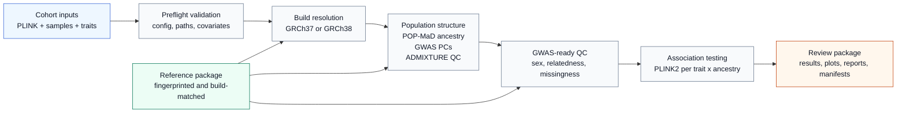

# Ancestry-Stratified GWAS Workflow

<p align="center">
  <strong>Production Snakemake workflow for ancestry-stratified GWAS</strong><br>
  This repository turns cohort genotypes, sample metadata, trait definitions,
  and a fingerprinted ancestry reference package into a reproducible,
  review-ready ancestry-stratified GWAS run. The workflow records configuration,
  reference, software, QC, and output provenance so analyses can be checked,
  rerun, and archived consistently.
</p>

<p align="center">
  The current implementation is Stage 1: cohort validation, ancestry and PC
  covariate generation, ancestry-stratified PLINK2 GWAS, and final result
  packaging. Later stages will be added separately.
</p>



## Start Here

If you are running cohort data, go straight to the
[Cohort Production Quickstart](docs/cohort-production-quickstart.md). It is the
short step-by-step operating guide for a production SLURM run.

Use this README as the project front page and documentation index.

## Documentation Map

| Area | Document | Purpose |
| --- | --- | --- |
| Run | [Cohort Production Quickstart](docs/cohort-production-quickstart.md) | Short start-to-finish runbook for SLURM cohort analyses. |
| Troubleshoot | [Cohort Production Troubleshooting Guide](docs/cohort-production-run-manual.md) | Step-organized fixes for setup, validation, QC, GWAS, reporting, and export failures. |
| Configure | [Configuration Guide](docs/configuration.md) | Field-by-field instructions for `config/config.yaml`, sample manifests (phenotype + covariate files), and trait registries. |
| Orient | [Pipeline Overview](docs/pipeline-overview.md) | Stage descriptions, expected outputs, and how the workflow is organized. |
| Reference | [Ancestry Reference Preparation](docs/ancestry-reference-prep.md) | How to use, validate, and document the ancestry reference package. |
| Provenance | [Resources And Downloads](docs/resources-and-downloads.md) | Software, reference, and resource records to keep with each release. |
| Develop | [Development Notes](docs/development-notes.md) | Focused checks for scripts, rules, and local workflow changes. |
| Example Data | [HapMap3 Development Data](docs/local-example-run.md) | Public development-data setup for non-production checks. |
| Methods | [Resource Methods](resources/README.md) | Genome-build marker-panel methods and resource details. |

Do not use the HapMap3 development-data commands for production analyses. A
production run requires a production-style `config/config.yaml` and a
build-matched, fingerprinted reference package.

## What The Pipeline Does

- Accepts one genome-wide PLINK dataset: `PGEN/PVAR/PSAM` or `BED/BIM/FAM`.
- Validates config, sample manifest (phenotype + covariate file), trait
  registry, software manifests, reference manifests, genotype files, reference
  package contents, and covariates.
- Infers genotype genome build from marker positions and writes build-resolved
  config snapshots.
- Computes POP-MaD ancestry and within-ancestry GWAS PCs from the approved
  reference package.
- Optionally runs supervised ADMIXTURE as report-only ancestry QC.
- Runs genetic sex checks, relatedness filtering, trait/covariate preparation,
  ancestry-stratified PLINK2 `--glm`, plotting, reporting, and manifest
  generation.

Stage 1 does not run imputation, pooled GWAS, METAL, trans-ancestry
meta-analysis, liftover, or reference-package construction.

## Required Inputs

Production runs require:

- one PLINK genotype prefix: `pgen` or `bed`
- a sample manifest TSV (phenotype + covariate file)
- a trait registry TSV
- the unpacked prebuilt ancestry reference package
- conda/mamba access for the Snakemake driver and rule environments
- reviewed software and reference manifests

The sample manifest (phenotype + covariate file) must include unique
`FID`/`IID` rows, `age`, `age2`, `sex`, all phenotype columns, and all non-PC
covariates used by configured traits. Sex codes must be `1`, `2`, `0`, `NA`,
`-9`, or `.`.

Calculate `age2` as a centered quadratic term, not raw `age^2`:

```text
mean_age = mean(age) across non-missing analysis samples
age2 = (age - mean_age)^2
```

Use the same age units as `age`, usually years, and document the `mean_age`
value used for the cohort release.

The trait registry must include:

```text
trait_id	phenotype_column	case_value	control_value	missing_values
```

An optional `covariates` column can list trait-specific covariates as
comma-separated names. Full schemas are in
[docs/configuration.md](docs/configuration.md).

## Output Landmarks

Core outputs are written under `results/`:

```text
results/config/effective_config.yaml
results/config/resolved_config.yaml
results/qc/
results/gwas/{trait}/{ancestry}/{trait}.{ancestry}.{build}.plink2.glm.tsv
results/gwas/{trait}/{ancestry}/{trait}.{ancestry}.{build}.gwas_filter_summary.tsv
results/plots/ancestry/{analysis_name}.popmad_reference_study_pcs.png
results/plots/{trait}/{ancestry}/{analysis_name}.{trait}.{ancestry}.{build}.qq.png
results/plots/{trait}/{ancestry}/{analysis_name}.{trait}.{ancestry}.{build}.manhattan.png
results/plots/{trait}/{ancestry}/{analysis_name}.{trait}.{ancestry}.{build}.manhattan.pdf
results/reports/{trait}/{analysis_name}.{trait}.{ancestry}.{build}.report.md
results/manifests/run_manifest.tsv
```

`{analysis_name}` is the filename-safe version of `project.analysis_name`.
Each GWAS report embeds the POP-MaD projection, QQ, and Manhattan plots and
summarizes ancestry and ADMIXTURE QC, sample filtering, variant filtering,
lambda GC, and top association signals.

Use the production manual for the review and archive checklist.

## Repository Map

```text
Snakefile                         Workflow entry point
workflow/rules/                   Snakemake rules
workflow/snake_helpers.py         Shared DAG helpers
scripts/                          R and shell helper scripts
scripts/lib/                      Shared R helpers
config/                           Config templates and public example inputs
envs/                             Conda environment definitions
profiles/slurm/                   SLURM execution profile
resources/                        Marker panels and provenance manifests
docs/                             User documentation
results/                          Generated outputs
```

`config/config.yaml` is intentionally untracked because production configs can
contain private paths. Start production configs from
`config/config.template.yaml`.

## Development Data

The HapMap3 files are public development data for focused script checks and
marker-panel maintenance. They are not a cohort analysis template and do not
replace the production reference package.

Use [docs/development-notes.md](docs/development-notes.md) and
[docs/local-example-run.md](docs/local-example-run.md) for development checks.

## Privacy And Security

Do not commit protected cohort data, credentials, or private external-drive
paths. Keep production inputs and `results/` on approved storage, and review
logs, reports, config snapshots, and manifests before sharing outputs because
they intentionally record runtime paths and provenance.
